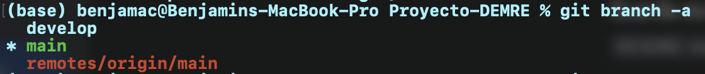

# 👋 ¡Bienvenido al Proyecto de Análisis de Puntajes de Pruebas de Acceso!

 **Todo esto es un ejemplo, modificar despues según corresponda**

# 🧑‍💻 IMPORTANTE PARA EL MANEJO DE LA BRANCHES (manejarse con precaución)

Este documento detalla los **tres pasos** que debemos seguir para trabajar en el rango de años asignado sin interferir con el trabajo del resto.

El trabajo debe realizarse *siempre* en una rama aislada de tu período.

---

## PASO B: Preparación e Inicio del Análisis

### 1. Sincronizar el Repositorio (Obtener la rama `develop`)

La rama `develop` es la base de todo el trabajo. Debes asegurarte de que tu copia local de Git sepa que esta rama existe en el servidor.

| Comando | Propósito |
| :--- | :--- |
| `git fetch` | **Descarga** la información más reciente del repositorio central, incluyendo la existencia de la nueva rama `develop`, sin modificar tus archivos. |
| `git checkout develop` | **Crea localmente** la rama `develop` (si aún no la tienes) y te ubica en ella. Ahora tienes la base de código compartida. |
| `git branch -a` | **Informa** en qué rama del proyecto nos encontramos parados. | 
| `git checkout nombre_rama` | **Cambia** la rama actual donde te encuentras es como un cd `nombre_carpeta`. |


La rama develop está creada, utilicé `git branch develop` y luego `git push -u origin develop` para que git la rastree solo, si sincronizan deberían poder verla.

### 2. Crear tu Rama de Período

Una vez en `develop`, debes crear tu rama de trabajo personal. **Utiliza la nomenclatura `periodo/<tu-rango-de-años>`**.

| Comando | Propósito |
| :--- | :--- |
| `git checkout -b <tu-periodo-asignado> develop` | **Crea una nueva rama** con tu nombre (ej. `periodo/2009-2013`) a partir de `develop` y te **mueve automáticamente a ella**. |

### Recomiendo que pregunten a IA sobre el trabajo en branches, para que entendamos como funcionan los commits, pull, merge, etc. Dentro de un proyecto ramificado.
---

## 🏗 Estructura del Repositorio


| Carpeta / Archivo | Descripción |
| :--- | :--- |
| `data/` | Contiene los datasets originales (crudos) y las versiones limpias (`data_clean`). **¡Advertencia: Archivos grandes!** |
| `notebooks/` | Espacio de trabajo para la exploración de datos (`EDA`), análisis estadístico y visualizaciones. |
| `scripts/` | Scripts de Python/R para tareas específicas (ej: limpieza, normalización, modelado). |
| `docs/` | Documentación adicional, incluyendo el **Diccionario de Datos Completo**. |
| `README.md` | Este archivo. |
| `LICENSE` | Información sobre la licencia del proyecto. |

---

## 🔎 El Corazón de los Datos: La Estructura

La base de datos se presenta en formato tabular (como un DataFrame de `pandas`), donde cada fila es un registro de resultados de un postulante.

### Variables Clave de un Vistazo

| Columna | Significado | Tipo de Dato | Rol Analítico |
| :--- | :--- | :--- | :--- |
| `ID_aux` | Identificador único de registro (anonimizado). | Alfanumérico | *Identificador* |
| `GRUPO_DEPENDENCIA` | Tipo de dependencia del establecimiento de egreso. | Categórico | **Socioeducativo** |
| `RAMA` | Modalidad de egreso (Humanista-Científica vs. Técnico-Profesional). | Categórico | **Contextual** |
| `SITUACION_EGRESO` | Condición del postulante al rendir la prueba. | Categórico | **Contextual** |
| `CODIGO_REGION` | Código de la región del establecimiento de egreso. | Categórico | **Geográfico** |
| `LENG_ACTUAL` | Puntaje en la prueba de Comprensión Lectora/Lenguaje. | Numérico | **Puntaje Objetivo** |
| `MATE_ACTUAL` | Puntaje en la prueba de Matemáticas. | Numérico | **Puntaje Objetivo** |

> **IMPORTANTE:** Los puntajes (`*_ACTUAL`) están en una escala estándar (generalmente entre 300 y 850). Para el detalle completo de los códigos (ej. el significado de `GRUPO_DEPENDENCIA = 1`), consulte el **[Diccionario de Datos Completo]** ubicado en la carpeta `docs/`.

---

## ⚙️ Primeros Pasos y Contribución

Para empezar a trabajar con el *dataset*:

1.  **Clonar el Repositorio:**
    ```bash
    git clone [URL_del_repositorio]
    ```
2.  **Configurar el Entorno:** Instalar las dependencias necesarias (usualmente `pandas`, `numpy`, `matplotlib`, `seaborn`, etc.).
3.  **Exploración Inicial:** Diríjase a la carpeta `notebooks/` y comience con el *notebook* de exploración de datos (ej. `01_EDA_Inicial.ipynb`).

### ⚠️ Consideraciones Éticas y de Uso

* Los datos están **anonimizados**. El uso de esta información está restringido al análisis estadístico y la investigación educativa.
* Trate las columnas de códigos (ej. `CODIGO_REGION`) como **variables categóricas** y no como variables continuas.

---

### **¡Tu contribución es clave para transformar datos en conocimiento educativo!**